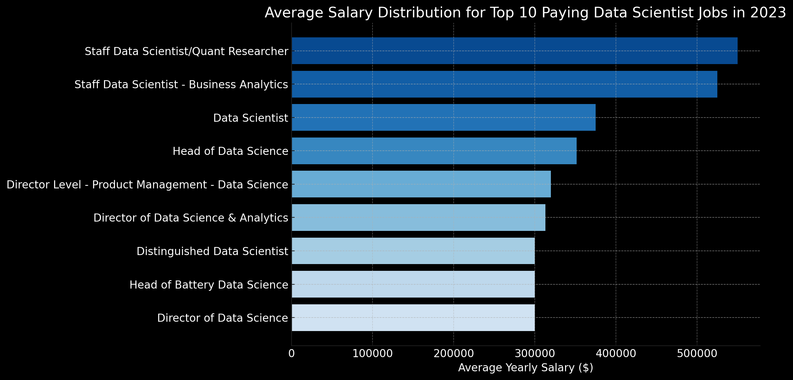
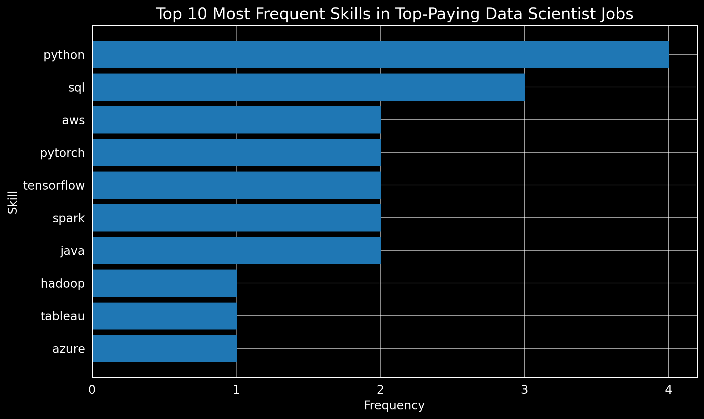

#  Data Science Job Market Analysis (SQL Project)

## Introduction

This project explores the job market with a focus on **Data Scientist roles**, using structured SQL queries to uncover high-paying positions, in-demand skills, and which skills offer the best salary-to-demand ratio.

> SQL queries are organized in the [project_sql](project_sql) folder.

## Background & Motivation

This project was created as part of my **self-learning journey** in preparation for the **Le Wagon Data Analytics Bootcamp** (starting July 2025). I followed [Luke Barousse’s SQL project course on YouTube](https://www.youtube.com/watch?v=7mz73uXD9DA).

I previously completed the **Python version of this project**, where I focused on **Data Analyst roles** using the same dataset. Since I had already explored that angle, I decided to shift focus in this SQL project to **Data Scientist jobs** — to better understand how the skill requirements and salary dynamics compare across roles in the data space.

This approach also allowed me to:
- Practice SQL in a structured way
- Expand my analysis to more technical and higher-paying job titles
- Build a diverse portfolio project that complements my Python work

## Questions Explored

- What are the top-paying **Data Scientist** jobs?
- What skills are required for these top-paying jobs?
- What skills are most in demand for data scientists?
- Which skills are associated with higher salaries?
- What are the **most optimal skills to learn** (based on both salary and demand)?

# Tools I Used
For my deep dive into the data science job market, I harnessed the power of several key tools:

- **SQL:** The backbone of my analysis, allowing me to query the database and unearth critical insights.
- **PostgreSQL:** The chosen database management system, ideal for handling the job posting data.
- **Visual Studio Code:** My go-to for database management and executing SQL queries.
- **Git & GitHub:** Essential for version control and sharing my SQL scripts and analysis, ensuring collaboration and project tracking.

# The Analysis
Each query for this project aimed at investigating specific aspects of the data science job market. Here’s how I approached each question:

### 1. Top Paying Data Scientist Jobs
To identify the highest-paying roles, I filtered data science positions by average yearly salary and location, focusing on remote jobs. This query highlights the high paying opportunities in the field.

```sql
SELECT	
	job_id,
	job_title,
	job_location,
	job_schedule_type,
	salary_year_avg,
	job_posted_date,
    name AS company_name
FROM    
    job_postings_fact
LEFT JOIN company_dim ON job_postings_fact.company_id = company_dim.company_id
WHERE
    job_title_short = 'Data Scientist' AND
    job_location = 'Anywhere' AND
    salary_year_avg IS NOT NULL 
ORDER BY salary_year_avg DESC
LIMIT 10;

```
## Here's the breakdown of the top data scientist jobs in 2023:

- **High Earning Potential:** The top 10 data scientist roles offer salaries between **$300,000 and $550,000**, emphasizing the strong compensation available for advanced data roles.

- **Diverse Employers:** High-paying positions are found across a range of industries, with companies like **Selby Jennings, Walmart, Reddit, and Demandbase** leading the way — indicating that demand spans across tech, finance, and enterprise sectors.

- **Leadership & Seniority:** Many top-paying roles include titles such as **"Director," "Head of Data Science," and "Distinguished Data Scientist"**, showing that higher salaries are closely linked to seniority and domain specialization.


*Bar graph visualizing the salary for the top 10 salaries for data scientists; ChatGPT generated this graph from my SQL query results*

### 2. Skills for Top Paying Jobs
To understand what skills are required for the top-paying jobs, I joined the job postings with the skills data, providing insights into what employers value for high-compensation roles.
```sql
WITH top_paying_jobs AS (
SELECT	
	job_id,
	job_title,
	salary_year_avg,
	job_posted_date,
    name AS company_name
FROM    
    job_postings_fact
LEFT JOIN company_dim ON job_postings_fact.company_id = company_dim.company_id
WHERE
    job_title_short = 'Data Scientist' AND
    job_location = 'Anywhere' AND
    salary_year_avg IS NOT NULL 
ORDER BY salary_year_avg DESC
LIMIT 10
)

SELECT 
    top_paying_jobs.*, 
    skills
FROM top_paying_jobs
INNER JOIN skills_job_dim ON top_paying_jobs.job_id = skills_job_dim.job_id 
INNER JOIN skills_dim ON skills_job_dim.skill_id = skills_dim.skill_id
ORDER BY
    salary_year_avg DESC;
```
### 🔧 Skill Trends in Top-Paying Data Scientist Roles (2023)

Here's the breakdown of the most demanded skills for the top 10 highest paying data scientist jobs in 2023:

- **Python** and **SQL** dominate the landscape, appearing most frequently across top-paying roles, with Python slightly ahead.
- **Cloud & Big Data tools** such as **AWS**, **Spark**, and **Hadoop** are commonly required, underscoring the importance of scalable data processing and cloud deployment.
- **Deep Learning frameworks** like **TensorFlow** and **PyTorch** are present in several listings, highlighting a strong demand for advanced machine learning expertise.

Other notable tools include **Tableau**, **Azure**, and **Java**, reflecting demand for visualization skills, cloud flexibility, and general programming.


*Bar graph visualizing the count of skills for the top 10 paying jobs for data scientists; ChatGPT generated this graph from my SQL query results*

### 3. In-Demand Skills for Data Scientists

This query helped identify the skills most frequently requested in job postings, directing focus to areas with high demand.

```sql
SELECT 
    skills,
    COUNT(skills_job_dim.job_id) AS demand_count
FROM job_postings_fact
INNER JOIN skills_job_dim ON job_postings_fact.job_id = skills_job_dim.job_id 
INNER JOIN skills_dim ON skills_job_dim.skill_id = skills_dim.skill_id
WHERE
    job_title_short = 'Data Scientist' AND
    job_work_from_home = TRUE
GROUP BY
    skills
ORDER BY demand_count DESC
LIMIT 5;
```

Here's the breakdown of the most demanded skills for data scientists in 2023

- **Python** is the most in-demand skill by a large margin — crucial for any data science role.
- **SQL** comes second, emphasizing the importance of data querying skills.
- **R** is still a strong contender, especially in statistics-heavy roles.
- **AWS** and **Tableau** highlight the demand for cloud computing and data visualization expertise.

| Skills   | Demand Count |
|----------|--------------|
| Python   | 10390        |
| SQL      | 7488         |
| R        | 4674         |
| AWS      | 2593         |
| Tableau  | 2458         |
*Table of the demand for the top 5 skills in data science job postings*

### 4. Skills Based on Salary
Exploring the average salaries associated with different skills revealed which skills are the highest paying.
```sql
SELECT 
    skills,
    ROUND(AVG(salary_year_avg),0) AS avg_salary 
FROM job_postings_fact
INNER JOIN skills_job_dim ON job_postings_fact.job_id = skills_job_dim.job_id 
INNER JOIN skills_dim ON skills_job_dim.skill_id = skills_dim.skill_id
WHERE
    job_title_short = 'Data Scientist' AND
    salary_year_avg IS NOT NULL
GROUP BY
    skills
ORDER BY
    avg_salary DESC
LIMIT 25;
```
Here's a breakdown of the results for top-paying skills for Data Scientists in 2023:

- **Niche & Emerging Tools Pay Big:** Specialized tools like Asana, Airtable, and Watson top the list, suggesting that unique or less common technologies can significantly boost salary potential.
- **AI/ML & Cloud Infrastructure Matter:** High-paying roles often require knowledge of cutting-edge ML frameworks (e.g., Hugging Face) and cloud services (e.g., DynamoDB, BigQuery).
- **Rare Programming Languages & Libraries:** Skills like Lua, Elixir, Haskell, and Neo4j — while not mainstream — are well rewarded, highlighting the advantage of mastering less common tools.

| Skills          | Average Salary ($) |
|-----------------|-------------------:|
| Asana           |            215,477 |
| Airtable        |            201,143 |
| Redhat          |            189,500 |
| Watson          |            187,417 |
| Elixir          |            170,824 |
| Lua             |            170,500 |
| Slack           |            168,219 |
| Solidity        |            166,980 |
| Ruby on Rails   |            166,500 |
| RShiny          |            166,436 |
*Table of the average salary for the top 10 paying skills for data scientists*

### 5. Most Optimal Skills to Learn

Combining insights from demand and salary data, this query aimed to pinpoint skills that are both in high demand and have high salaries, offering a strategic focus for skill development.

```sql
SELECT 
    skills_dim.skill_id,
    skills_dim.skills,
    COUNT(skills_job_dim.job_id) AS demand_count,
    ROUND(AVG(job_postings_fact.salary_year_avg), 0) AS avg_salary
FROM job_postings_fact
INNER JOIN skills_job_dim ON job_postings_fact.job_id = skills_job_dim.job_id
INNER JOIN skills_dim ON skills_job_dim.skill_id = skills_dim.skill_id
WHERE
    job_title_short = 'Data Scientist'
    AND salary_year_avg IS NOT NULL
    AND job_work_from_home = True 
GROUP BY
    skills_dim.skill_id
HAVING
    COUNT(skills_job_dim.job_id) > 10
ORDER BY
    avg_salary DESC,
    demand_count DESC
LIMIT 25;
```
 Here's a breakdown of the most optimal skills for Data Scientists in 2023:

- **Balanced Skills in Demand & Pay:** Tools like Snowflake, GCP, and BigQuery stand out for combining strong demand (36–72 postings) with high salaries (>$150K), making them highly attractive to learn.
- **Niche Yet Lucrative:** Languages such as Go and C, while less mainstream, offer average salaries above $164K, showing their value in specialized or systems-level data science roles.
- **Foundation Still Matters:** Python and SQL remain top skills in demand — while not always the highest-paid, their ubiquity cements them as core foundations for any data science career.

| Skill ID | Skills       | Demand Count | Average Salary ($) |
|----------|--------------|--------------|-------------------:|
| 26       | c            | 48           |            164,865 |
| 8        | go           | 57           |            164,691 |
| 187      | qlik         | 15           |            164,485 |
| 185      | looker       | 57           |            158,715 |
| 96       | airflow      | 23           |            157,414 |
| 77       | bigquery     | 36           |            157,142 |
| 3        | scala        | 56           |            156,702 |
| 81       | gcp          | 59           |            155,811 |
| 80       | snowflake    | 72           |            152,687 |
| 101      | pytorch      | 115          |            152,603 |

# What I Learned

Throughout this adventure, I've turbocharged my SQL toolkit with some serious firepower:

- **Complex Query Crafting:** Mastered the art of advanced SQL, merging tables like a pro and wielding WITH clauses for ninja-level temp table maneuvers.
- **Data Aggregation:** Got cozy with GROUP BY and turned aggregate functions like COUNT() and AVG() into my data-summarizing sidekicks.
- **Analytical Wizardry:** Leveled up my real-world puzzle-solving skills, turning questions into actionable, insightful SQL queries.

# Conclusions

### Insights  
From the analysis of top-paying and high-demand data scientist roles, key takeaways include:

1. **Top-Paying Data Scientist Jobs**: The highest-paying roles range up to $550,000/year, often tied to senior and leadership titles like Director or Head of Data Science, showing the lucrative potential at the top of the field.

2. **Skills for Top-Paying Jobs**: Python and SQL are consistently present in top-paying job postings. Specialized tools like TensorFlow, PyTorch, and Spark also stand out, especially for roles in machine learning and big data.

3. **Most In-Demand Skills**: Python leads all skills in demand, followed by SQL and R, confirming their foundational role in the data science job market.

4. **Skills with Higher Salaries**: Niche or emerging technologies like Asana, Airtable, and Watson command the highest average salaries, indicating that rare or specialized tools offer strong earning power.

5. **Optimal Skills for Job Market Value**: Tools like Snowflake, GCP, and BigQuery balance both strong demand and high salaries, making them smart investments for aspiring data scientists looking to boost employability and earnings.

### Closing Thoughts

This project was a self-directed initiative to sharpen my SQL skills and gain a deeper understanding of the data science job market before joining the Le Wagon Data Analytics Bootcamp. By exploring high-paying roles and in-demand skills, I was able to identify the key technical areas that offer the greatest career value. The process helped me build confidence in working with real-world datasets and reinforced the importance of aligning my learning path with current industry trends. It also confirmed my decision to invest in continuous development through structured learning.
